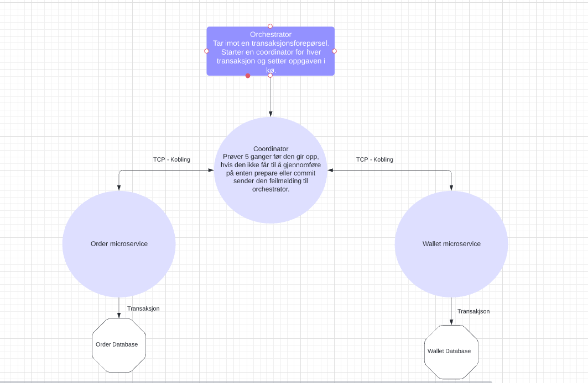
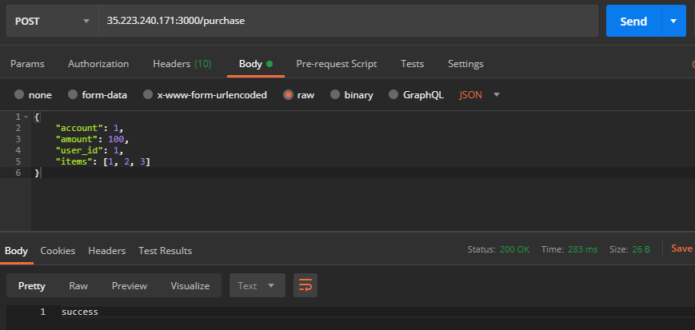
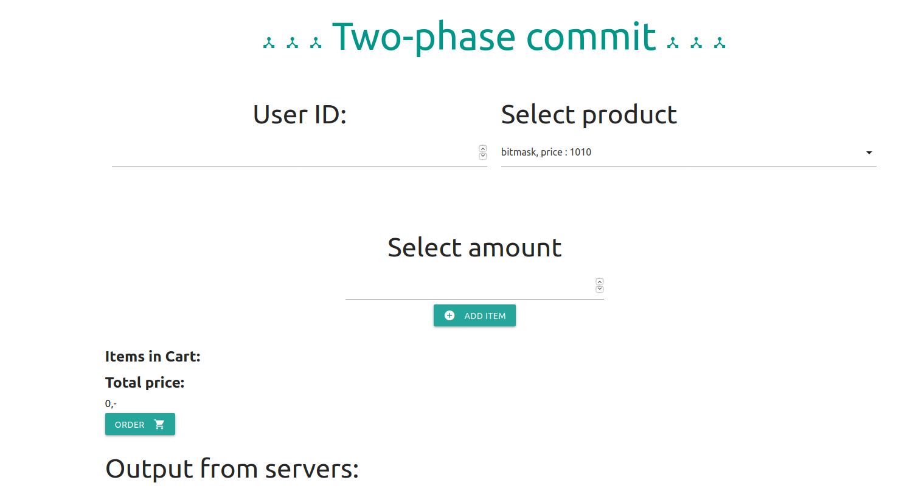
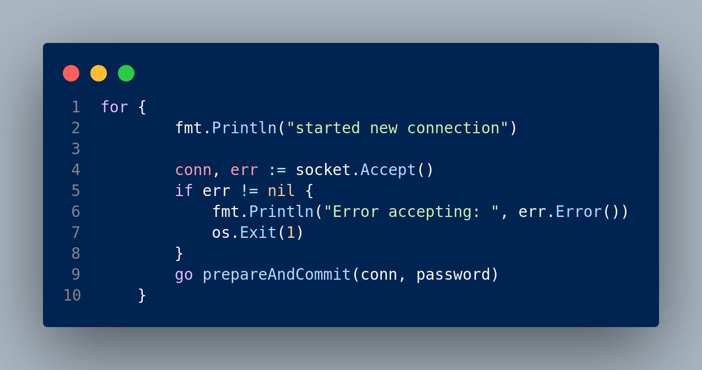
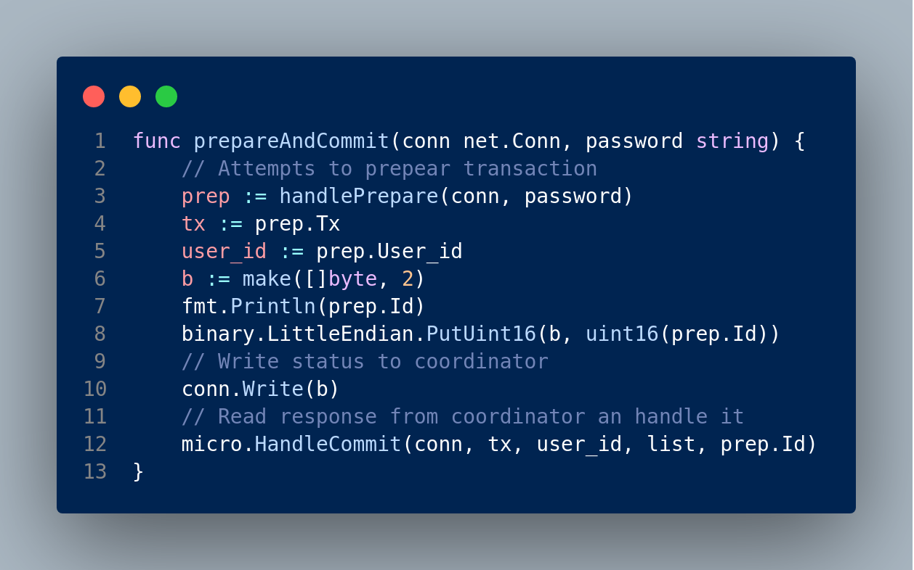
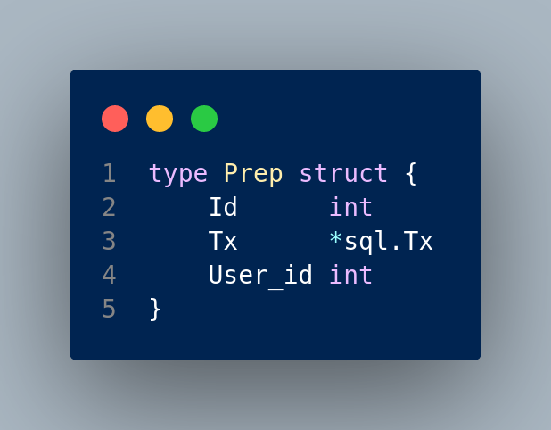
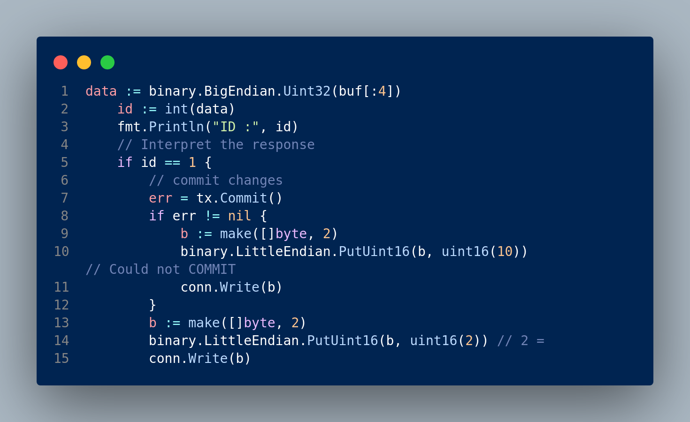

# Two-Phase-Commit
[Lenke til Continious Integration Løsning](https://gitlab.stud.idi.ntnu.no/dilawarm/two-phase-commit)
## Introduksjon
Dette prosjektet har blitt gjennomført som en del nettverksprogrammeringsdelen av emnet TDAT2003.

Dette prosjektet har gått ut på implementere to-fase commit. To-fase commit er en distribuert algoritme som brukes i forbindelse med transaksjoner i arkitekturer hvor tjeneren er delt opp i mindre enheter, også kjent som _microservices._ Hensikten med dette er for å lage skalerbare applikasjoner og systemer, og man unngår at man bare har en monolittisk tjener som skal ta seg av alle forespørsler. Microservicene har ansvar for å utføre hver sin del av systemet, og disse servicene kommuniserer med en "hoved-tjener", _orchestrator_, som har ansvaret med å delegere oppgaver til servicene og gi dem riktig data.

Hensikten med to-fase commit er å sørge for at en transaksjon utføres på en korrekt måte. Når man har delt klienten sin opp i flere enheter, så må man sørge for at disse kommuniserer på en god måte. Hvis det for eksempel skjer en feil med en microservice pga. en transaksjon som har blitt gjort, så ønsker man ikke at denne transaksjonen skal gå gjennom (_commit_) i en annen microservice. To-fase commit løser dette problemet på følgende måte:

1. _Orchestrator_ ("hoved-tjeneren") gir microservicene data, og ber dem utføre transaksjonen.
2. Microservicene starter transaksjonen, og låser de eventuelle radene i sine databasetabeller. Etter at de har startet transaksjonen, så gir microservicene tilbakemelding til _orchestrator_ om hvordan det gikk, dvs. om oppstarten av transaksjonen gikk bra eller dårlig.
3. Hvis alle microservicene svarte med at det gikk bra, så ber _orchestrator_ microservicene om å _commit transaction_. Da vil microservicene _committe_ transaksjonene. Hvis det ikke gikk bra, så vil _orchestrator_ be dem om å gjøre _rollback_, dvs. ikke gå videre med transaksjonene.

## Implementert funksjonalitet
I løsningen vår har vi implementert funksjonaliteten som trengs for en to-fase-commit, ved å lage en "orchestrator" server skrevet i rust, og to microservicer "wallet" og "order" i GO. Orchestrator, i tillegg til å håndtere transaksjons-forespørsler, serverer også en klient hvor transaksjonene kan forespørres. Microservicesene "wallet" og "order" har hver sin lokale database som de gjør transaksjoner mot. Wallets tilhørende database inneholder en tabell med bruker-id og tilhørende saldoer. 

Orders tilhørende database inneholder to tabeller, en som inneholder alle ordrene som er gjort, og 
en annen som inneholder alle varene som finnes og hvor mange det er igjen av hver. Hver av serverne orchestrator, wallet, og order kjører på hver sin virtuelle maskin i google cloud og disse oppdateres automatisk med continous deployment via GITLAB CI/CD. De virtuelle maskinene fra google cloud har sine egne lokale databaser. Ved oppdatering av serverne kjøres det også automatiske integrerte tester som sjekker om hele systemet fungerer som det skal. Testene sender hele transaksjons-requester til en lokalt kjørt orchestrator og sjekker om transaksjonene går gjennom når de burde. 

Implementasjonen er forsøkt gjort så realistisk som mulig med tanke på automatikken som er innebygd ved hjelp av google cloud og Gitlab CI/CD. Hele systemet kan lett testes både lokalt og distribuert, ettersom oversetting av localhost til de virkelige distribuerte addressene skjer automatisk med CD.

## Diskusjon
### Orchestrator og Koordinator

Orchestrator er overhodet som starter og holder styr på alle koordinatorene. Den har også ansvar for å ta imot TCP tilkoblinger. Når den mottar en TCP tilkobling blir den lest fra og svart på i sin egen tråd som kalles for en koordinator. Koordinatoren tolker http-forespørseler, enten som enten er «POST /purchase» hvor koordinatoren tar kontakt med microservicene våre. Koordinatoren leser data om ordren fra et JSON objekt i POST-forespørselen. En POST forespørsel kan for eksempel se slik ut: 

Koordinatoren har ansvaret for å kommunisere med microservicene og koordinere de slik at om en av de feiler vil begge rulle endringene tilbake, eller hvis begge er klare så kan begge commite endringene.
Koordinatoren har også ansvaret for å sende klienten til en nettleser hvis http-forespørselen er «GET /». Klienten lar brukeren teste systemet vårt lettere. Det er viktig at den leveres fra samme server som håndterer POST for å samsvare med CORS kravene. Klienten ser slik ut: 

Orchestrator og Koordinator er skrevet i Rust fordi Rust har veldig god trådsikkerhet og god feilhåndtering. Alle steder hvor Koordinator kan feile har vi implementert feilhåndtering med utskrift som forteller server administrator hva som har gått galt. Skulle en av microservicene mislyktes prøver den igjen inntil 5 ganger. Dermed vil man unngå at forespørsler mislyktes fordi de blir blokket av tråder som kjører parallelt. Vi bruker kun ett tredjeparts bibliotek for Koordinator, serde, som er for å tolke json objekter fra tekst. Resten gjøres manuelt ved å lese og skrive bytes fra TCP koblinger ved å bruke Rust sine innebygde TCP sockets.

### Microservicer (order og wallet)
Under planlegging av hvordan vi skulle lage microservicene bestemte vi oss å bruke programmeringsspråket Golang siden det har støtte for goroutines. Det er lett å implementere ved hjelp av nøkkelordet "go" i dette språket. Goroutines har dynamiske _stack_, noe som gjør at de bruker mer minne kun når de trenger det. Goroutines starter også raskere enn tråder. En goroutine kan kjøre på flere tråder, noe som gjør at disse blir veldig effektive.

I microservicene har vi delt opp logikken for hver tråd i to metoder: "handleprepare" og "handleCommit", "handleprepare" er forskjellig for det to microservicene ettersom det er forskjellige ting som kan gå galt. "handlecommit" er lik for begge, og finnes derfor i et felles bibliotek "micro" som er en egen golang fil. 

I hovedtråden (for-loopen over) venter servicene på en socket connection på hver sin port. Kommuikasjonsmetoden mellom serverne kunne blitt gjort på mange måter, men vi valgte å bruke sockets ettersom det var fordelmessig å kunne kommunisere frem og tilbake på samme kanal. Valgene mellom sockets var tcp og udp. Vi valgte å bruke tcp fordi tcp-protokollen er en pålitelig overføringstjeneste og sørger for at all kommunikasjon kommer gjennom som den skal. UDP er ikke pålitelig, men har mindre overhead. Ettersom vi skal utføre transaksjoner og det er viktig at meldinger kommer frem og kan stoles på er det ikke verdt det med udp. Tcp gjør det også enkelt å sende og lese nøyaktig det vi trenger og ikke noe mer. Hver melding inneholder kun et tall som har en intern betydning mellom coordinatoren og servicen. 

Ved opprettelse av en connection starter servicen en goroutine "handlePrepareAndCommit". Hovedtråden går øverst i loopen igjen og venter på en ny connection, mens goroutinen setter igang med å kommunisere på connectionen som ble opprettet. Hovedtråden tar da altså konstant imot oppkoblinger og starter kommunikasjonen. Slik kan servicen håndtere mange transaksjoner samtidig.

Metoden som er vist ovenfor kjøres for hver goroutine. I metoden _handlePrepare()_, så tar goroutinen og leser inn byte-data fra koblingen den har med coordinatoren, og starter transaksjonen med MySQL-databasene. Det er her den først delen av to-fase commit algoritmen implementeres, det vil si når miroservicene låser de aktuelle databaseradene og gir beskjed til orchestrator om hvordan det gikk med transaksjonen. Måten vi har løst dette på er å lage en _struct_ som ser slik ut:

_Prep_ er en _struct_ som består av tre attributter. Id er et tall som brukes i forbindelse med kommunikasjon mellom microservice og orchestrator. Det er dette tallet som indikerer hvordan det gikk med transaksjonen. Hvis transaksjonen gikk bra, så er Id lik 1, og ellers så får Id andre verdier ut i fra hva som gikk galt. For eksempel kan microservice ha problemer med å koble seg til databasen, og da er Id lik 4. Det neste attributtet er selve transaksjonsobjektet. Dette objektet må lagres av goroutinen for å kunne _commit_ eller _rollback_ transaksjonen ut ifra hva slags tilbakemelding _orchestrator_ gir til microservicene. Det tredje attributtet er User_id, som er id'en til brukeren som sendte HTTP-request til orchestrator. Grunnen til at vi lagrer bruker-id er for å håndtere problemet med at en bruker sender flere forespørsler på rad med meget kort tidsintervall, eller at det kommer flere forespørsler parallelt med samme bruker_id. Det kan føre til at microservice kan _committe_ en transaksjon som ikke skulle ha blitt _commited_, eller at goroutinen prøver å _committe_ en transaksjon som ikke eksisterer. For å løse dette lagret vi bruker-id'en i et hash-map. Når vi da fikk en ny forespørsel, så sjekker vi om brukeren har en transaksjon som ikke er _commited_. Hvis den har det, så sender vi feilmelding til _orchestrator_, ellers legger vi til den nye bruker-id'en. Det er viktig å understreke at vi kun sender Id til _orchestrator_, resten lagres hos microservice. Dette gjøres for å ikke bruke mer minne enn vi må.

Etter at microservicene har fått svar fra orchestrator (dvs. om de kan committe eller rollbacke), så kjøres _HandleCommit()_-metoden. Som vist i skjermbildet fra _prepareAndCommit()_-metoden, så tar denne metoden inn blant annet bruker-id'en og selve transaksjonsobjektet. Microservicen leser meldingen fra orchestrator. Hvis meldingen er 1, så committer den transaksjonen. Hvis det er noe annet, så committes ikke meldingen. Denne metoden tar også inn bruker_id for å fjerne brukeren fra hashmap slik at vi i fremtiden kan legge til nye forespørsler fra denne brukeren uten noe problem.

## Distribuert løsning

Siden to-fase-commit handler mye om å kunne ta imot mange transaksjoner samtidig og sørge for at de går gjennom på riktig måte, har vi valgt å lage en distribuert løsning. For å gjøre dette kjører vi serverne på individuelle virtuelle maskiner. Vi hadde mulighet til å be om virtuelle maskiner fra NTNU, men valgte å gå for google cloud ettersom vi har erfaring med å bruke tjenestene fra før. Google cloud er også gratis å bruke inntil en viss grense. Med google cloud var det også enkelt å tilpasse og sette opp maskinene vi hadde bruk for. Vi satte opp tre virtuelle maskiner, én for hver server. For å sette opp maskinene på en trygg måte valgte vi å sette opp egne brukere på maskinene uten administrator rettigheter, med egne lokale databaser. Istedenfor å laste opp og starte serverne manuelt valgte vi å implementere continous deployment ved hjelp av Gitlab CI/CD. 

Serverne leser inn forskjellige addresse-filer og config filer som sier noe om hvilken ip-addresse de skal høre på og hvilken database de skal koble seg til. I vår gitlab-ci fil forandrer vi automatisk på addressene som brukes og har manuelt lagt inn riktig database-tilkobling i .config filene på de virtuelle maskinene. Dette gjør at vi ikke trenger å tenke på å forandre fra f.eks "localhost" når vi tester lokalt og pusher til git. For å oppdatere filene og restarte serverne på google cloud har vi brukt ssh og nøkkel-variabler som er lagret i gitlab. Docker-executoren bruker ssh for å komme seg inn på google cloud maskinene og rsync for å oppdatere filene som ligger på maskina med det som ligger i git. Til slutt restarter den servicen som kjører serveren til tilhørende maskin. Dette er likt for alle maskinene; orchestrator, wallet og order. Ettersom orchestrator hører på port 3000 og serverer en klient ved http GET-request kan vi aksessere løsningen ved å skrive inn ip-addressen til orchestrator etterfulgt av portnummeret i nettleseren.

## Videre arbeid

Lagd et mer utvidet system for å kunne se mer om hva som ligger i databasen, for eksempel hvor mye saldo en bruker har eller hvor mye det er igjen av et produkt. Dette kunne ha blitt kombinert med flere microservices, men konseptet blir fortsatt helt likt som det vi har satt opp her.

Vi kunne også ha implementert Kubernetes for å ha et mer skalerbart system, da det ofte brukes i kombinasjon med microservices. 

## Eksempler 

## Installasjonsinstruksjoner

1. Installer go og rust
2. Git clone prosjektet
3. Installer en lokal mysql database (f.eks mariadb), og lage databasen wallet_service
4. Kjør sql koden i /test/data-dumps
5. Lag en fil som heter ".config" ytterst i filstrukturen
6. Skriv "<database_brukernavn>:<database_passord>@tcp(localhost:3306)" inni .config
7. Skriv "go get github.com/go-sql-driver/mysql" i terminalen
__Gjør enten 8 eller 9__
8. Kjør /bin/bash runservers
9. Kjør cargo run, go run /microservices/wallet.go og go run /microservices/order.go
10. Klienten er nå tilgjengelig på http://127.0.0.1:3000

## Hvordan teste løsningen

Løsningen vår blir testet automatisk med CI/CD. Et eksempel på en velllykket pipeline er ... . Dere kan også teste løsningen vår på http://35.223.240.171:3000/. Her brukes serverne på Google Cloud, så denne lenken brukes for å teste skyløsningen vår. Dere kan også kjøre tester lokalt på følgende måte:
1. cd test && npm install
2. Endre host, username og password i config.json slik at passer databasen dere har satt opp.
3. Kjør serverne (se punkt 8 eller 9 i __Installasjonsinstruksjoner__)
4. npm test
